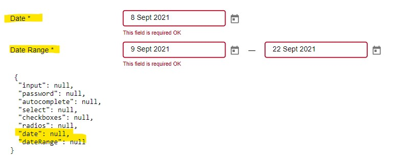
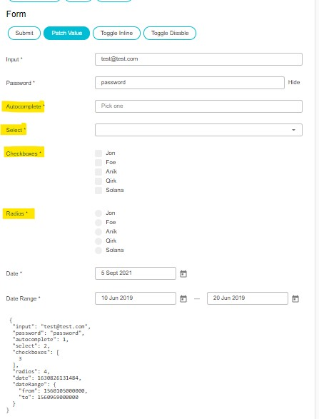

= Bug Report
Ayman Patel

== Date Error (False Positive)

Date fires `onError` and data is not populated manually (see bottom)
But date gets populated on Patch Value

== Patch Value Button

Patch not populating for

1. Autocomplete
2. Select
3. Checkboxes
4. Radios

But gets populated in store. (See bottom)

